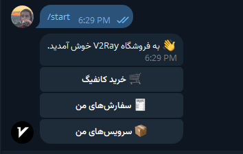
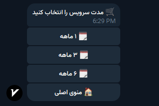
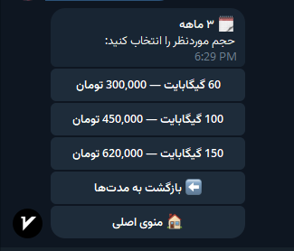
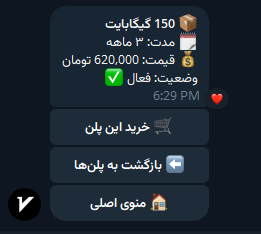
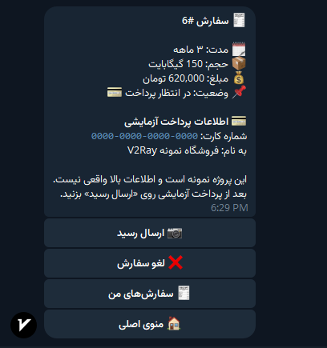
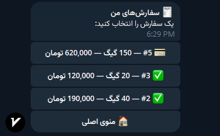
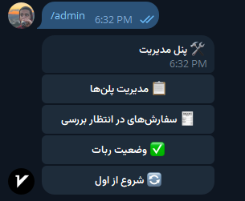
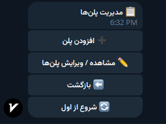
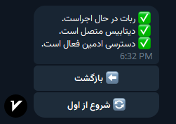

# V2Ray Shop Bot

A Persian Telegram shop bot built with **Python**, **Aiogram 3**, and **SQLite**.

This project is a portfolio/demo implementation of a V2Ray configuration shop. Users can browse plans by duration and traffic, create orders, submit payment receipts, track orders, and view demo services. An admin can manage plans and review submitted orders directly inside Telegram.

> **Demo project:** payment details, V2Ray configs, and subscription links are intentionally fake/demo data. No real payment gateway or V2Ray/Marzban server is connected in this version.

## Features

### User

- Fully Persian Telegram interface
- Browse plans by duration:
  - 1 month
  - 3 months
  - 6 months
- Different traffic packages for each duration
- Plan details and pricing
- Manual/demo payment flow
- Receipt image upload
- Order history and status tracking
- Cancel unpaid orders
- Demo service creation after admin approval
- Service details with expiry date
- Copyable demo config and subscription link

### Admin

Admin access is available only through `/admin`.

- One-time secure admin claim during first setup
- Add plans
- Edit plan traffic and price
- Activate/deactivate plans
- Review pending payment receipts
- Approve or reject orders
- Automatic demo service creation after approval
- Bot/database status page
- Back and Start Over navigation inside the admin panel

## Screenshots

### User flow

<table>
  <tr>
    <td align="center"><b>Main menu</b><br></td>
    <td align="center"><b>Duration</b><br></td>
    <td align="center"><b>Plans</b><br></td>
  </tr>
  <tr>
    <td align="center"><b>Plan details</b><br></td>
    <td align="center"><b>Payment</b><br></td>
    <td align="center"><b>My orders</b><br></td>
  </tr>
</table>

### Admin flow

<table>
  <tr>
    <td align="center"><b>Admin panel</b><br></td>
    <td align="center"><b>Plan management</b><br></td>
    <td align="center"><b>Bot status</b><br></td>
  </tr>
</table>

## Tech Stack

- Python 3.10–3.14
- Aiogram 3
- SQLite
- python-dotenv
- Telegram Bot API
- Long polling

## Quick Setup — Windows

The project includes a beginner-friendly installer.

1. Create a Telegram bot with **@BotFather** and copy its token.
2. Extract the project ZIP.
3. Double-click `setup.bat`.
4. If a compatible Python version is not installed, the setup script downloads and installs Python for the current Windows user.
5. Paste your BotFather token when asked.
6. Setup creates the virtual environment, installs dependencies, validates the token, initializes configuration, and displays a one-time admin code.
7. Double-click `run.bat`.
8. Open your bot and send `/start`.
9. Claim admin access once with:

```text
/claimadmin YOUR_CODE
```

After that, open the admin panel with:

```text
/admin
```

For normal future use, only run `run.bat`.

## Useful Commands

| Command | Purpose |
|---|---|
| `/start` | Open/reset the user menu |
| `/cancel` | Cancel the current multi-step operation |
| `/whoami` | Show your Telegram user ID |
| `/admin` | Open the admin panel if authorized |
| `/claimadmin CODE` | One-time admin activation |

## Project Structure

```text
.
├── app/
│   ├── handlers/
│   │   ├── admin.py
│   │   ├── common.py
│   │   ├── orders.py
│   │   └── plans.py
│   ├── config.py
│   ├── db.py
│   └── keyboards.py
├── assets/
│   └── screenshots/
├── data/
├── scripts/
│   └── validate_token.py
├── .env.example
├── .gitignore
├── requirements.txt
├── run.py
├── setup.bat
└── run.bat
```

## Data & Security

- Bot token and setup secret are stored in `.env` and ignored by Git.
- Runtime SQLite databases are ignored by Git.
- Telegram receipt images are not downloaded to the project; Telegram `file_id` values are stored instead.
- Admin operations verify the authorized Telegram user ID.

## Demo Data

On a fresh database, sample plans are created automatically:

- **1 month:** 20 / 40 / 60 GB
- **3 months:** 60 / 100 / 150 GB
- **6 months:** 120 / 200 / 300 GB

The admin can change prices, traffic values, availability, and add more plans from Telegram.

## Current Limitations

Version `v1.0.0` is intentionally a demo/portfolio release:

- No real payment gateway
- Payment card information is fake
- No real Marzban/x-ui integration
- Generated V2Ray config and subscription URLs are demo values
- No real traffic usage synchronization
- Designed for local Windows execution with long polling

A future version can connect the order approval flow to a real V2Ray management API such as Marzban.

## Version

**v1.0.0 — Portfolio V1**
